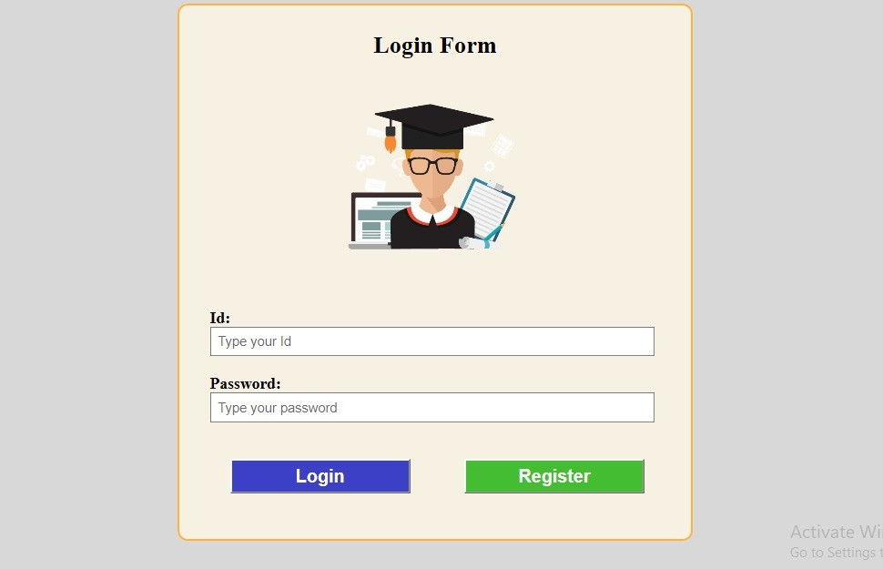
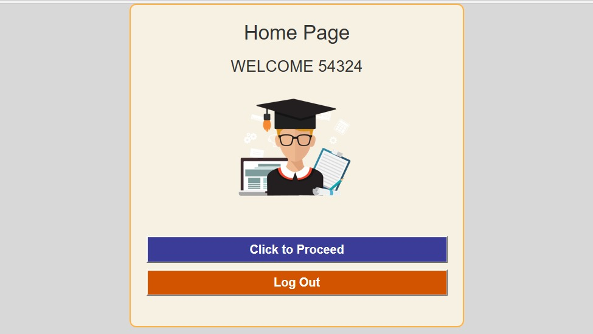
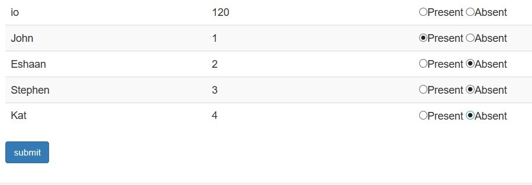

# Attendance Management System 🏫 

Github Repo link : https://github.com/eshaan007/Attendance-Management-System

### It is divided into 2 parts 
 - A view portal for insertion
 - View System for the faculty and Student
 
#### It uses HTML, CSS as Front-End, PHP for Backend, MySQL for Database Handling and XAMPP Server for hosting.

An Attendance View Portal is developed. The login page is common for both the faculty as well as students. At the end, the attendance is submitted to the database. \
When a successful login occurs, faculty can see the date wise attendance of all the subjects. The student will be able to see his/her date wise or subject wise attendance.

## This is what every file in my Repository does : 

- ***config.php*** :            Makes connection with localhost and other different files. 
- ***admin.php*** :             Registers himself. From welcome page, he goes to different pages from the panel. 
- ***blockchain.php*** :        Gives information for this particular subject. 
- ***header.php*** :            Common Header for every student and teacher's pages. 
- ***hompage.php*** :           After Login, the user is welcomed to this page. 
- ***ind.php*** :               Gives the overview for the teacher's Home page. 
- ***index.php*** :             This the Login page for the users. 
- ***lab.php*** :               Gives information for this particular subject. 
- ***register.php*** :          For Student 
- ***register7.php*** :         For Teacher by admin 
- ***show_attendance.php*** :   It displays the attendance to the students. Given access by teacher. 
- ***viewall.php*** :           It contains the link of View Attendance for all. 
- ***web.php*** :               Gives information for this particular subject. 

### These are the attached screenshots of the webpage : 

#### The Login Page, The Welcome Home Page and The Student Database Page

